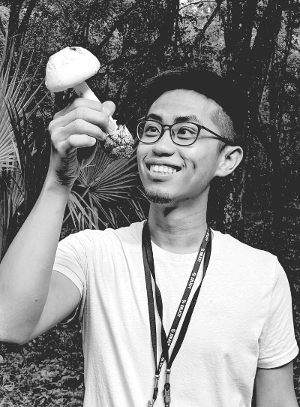

{:refdef: style="text-align: center;"}

{: refdef}

Welcome to my site. My name is Yin-Tse Huang. I study symbiosis, using fungi, beetles, and plants as my model systems. I combine conventional/molecular sampling methods and statistical analysis approaches to help understanding the fasinating though often complicated symbiotic relationships among organisms. In addition to research, I am a fan of cooking and photography.
